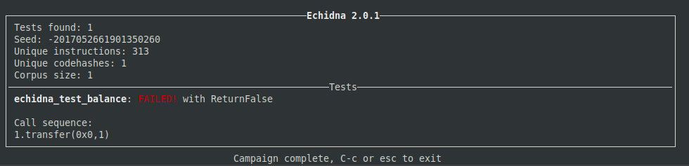
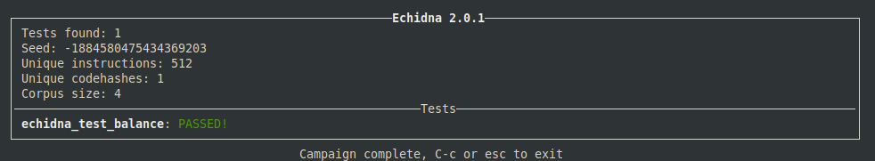

# [Echidna Tutorial exercises](https://github.com/crytic/building-secure-contracts/tree/master/program-analysis/echidna)


## Properties

Echidna properties are Solidity functions. A property must:
- Have no argument
- Return true if it is successful
- Have its name starting with echidna

Echidna will:
- Automatically generate arbitrary transactions to test the property.
- Report any transactions leading a property to return false or throw an error.
- Discard side-effects when calling a property (i.e. if the property changes a state variable, it is discarded after the test)

## Run test

echidna-test contract.sol [--contract MyContract]





## Testing mode

### Default: Boolean property 
- Testing functions take no parameters, and always return a boolean value
- Any side effect will be reverted at the end of the execution of the property. 
- Properties pass if they return true
- This mode can be used when a property can be easily computed from the use of state variables (either internal or public), and there is no need to use extra parameters.

### Assertions
Using the "assertion" testing mode, Echidna will report an assert violation if:

The execution reverts during a call to `assert`. Technically speaking, Echidna will detect an assertion failure if it executes an `assert` call that fails in the first call frame of the target contract (so this excludes any internal transactions in most of the cases).
An `AssertionFailed` event (with any number of parameters) is emitted by any contract.

You should use assertions if your invariant is more natural to be expressed using arguments or if it can only be checked in the middle of a transaction. Another good use case of assertions is complex code that require to check something as well as changing the state.

### Dapptest
Using the "dapptest" testing mode, Echidna will report violations using certain functions following how dapptool and foundry work. Use dapptest mode if you are testing stateless invariants and the code will never unexpectedly revert. Avoid using it for stateful testing, since it was not designed for that (however, Echidna supports it).

### Stateless vs Stateful
Any of these testing modes can be used, in either stateful (by default) or stateless mode (using --seqLen 1). In stateful mode, Echidna will keep the state between each function call and will try to break the invariants. In stateless, Echidna will discard the state changes during the fuzzing.


## Filtering functions to call during a fuzzing campaign

```
filterBlacklist: true
filterFunctions: ["C.f1()", "C.f2()", "C.f2(uint256)"]
```
```
echidna-test contract.sol --config config.yaml  
```


## Installation

```
docker pull trailofbits/eth-security-toolbox
docker run -it -v "$PWD":/home/training trailofbits/eth-security-toolbox
```

Inside the container:
```
solc-select use 0.5.11
cd /home/training
```


